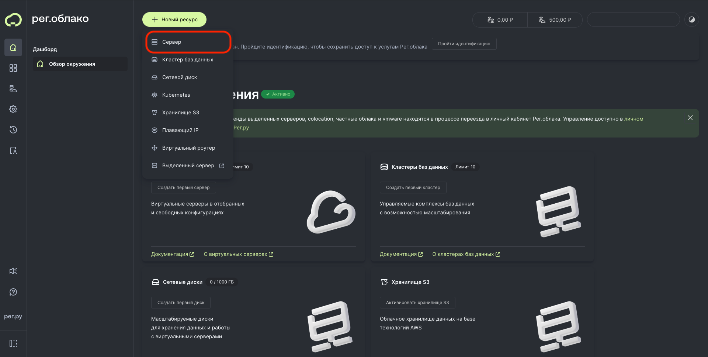
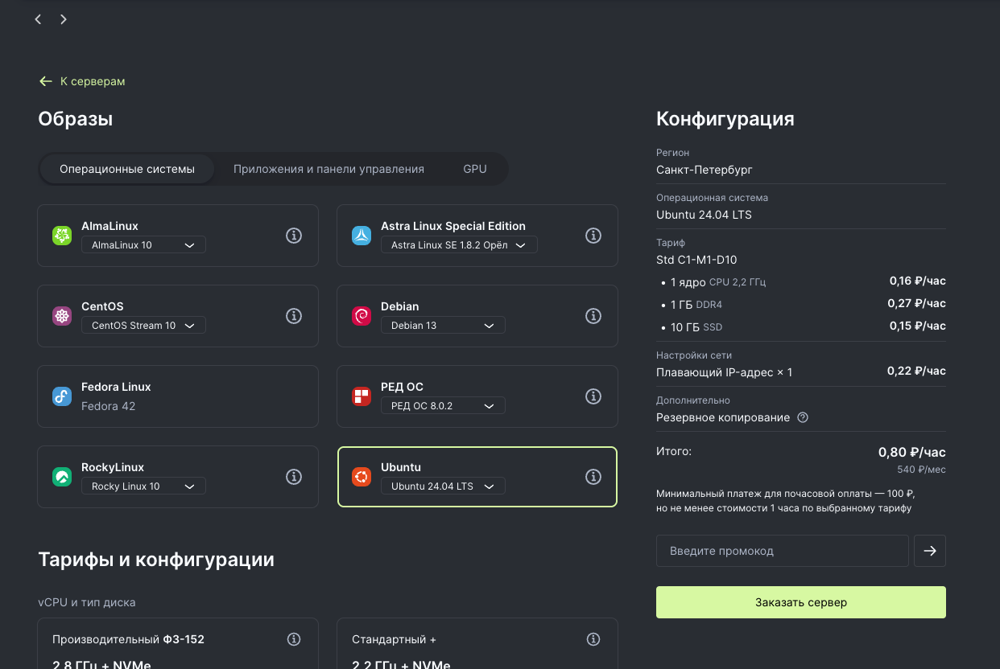
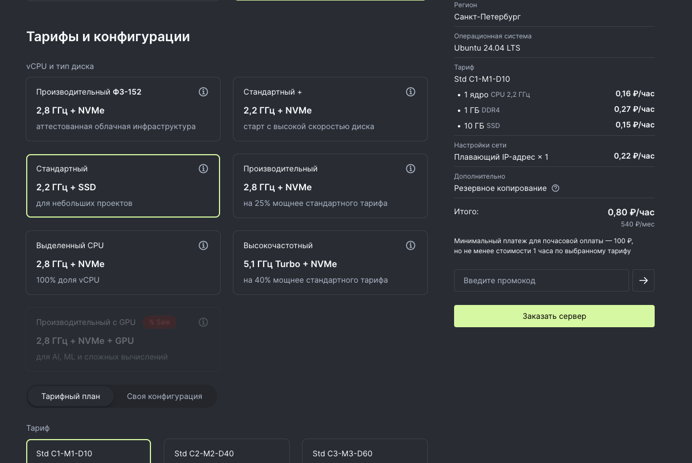
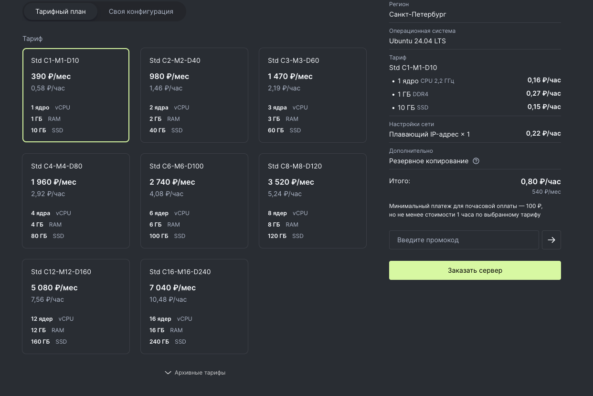
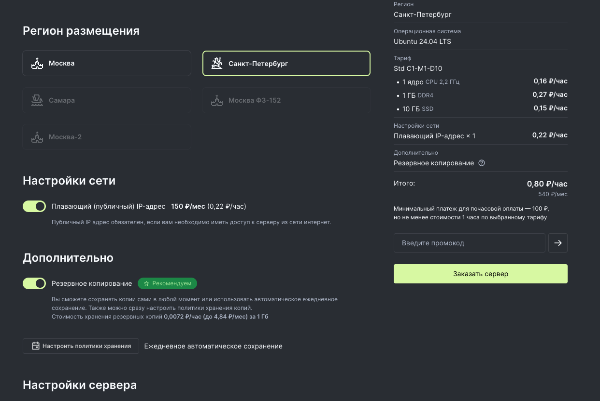
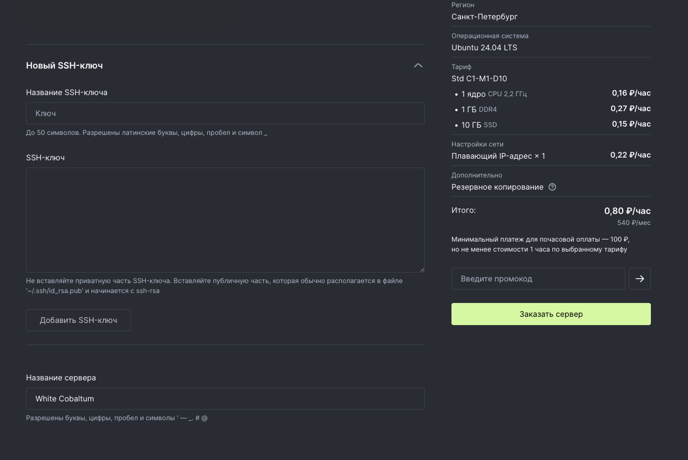

# Дипломный проект по профессии «Fullstack-разработчик на Python»

## Облачное хранилище My Cloud

Группа: FPY-100

## Содержание

- [Описание структуры проекта](#описание-структуры-проекта)
- [Инструкция по развертыванию приложения на сервисе reg.ru](#инструкция-по-развертыванию-приложения-на-сервисе-regru)
  - [1. Предварительные шаги](#1-предварительные-шаги)
    - [1.1. Способы открытия терминала](#11-способы-открытия-терминала)
    - [1.2. Создание виртуального сервера](#12-создание-виртуального-сервера)
  - [2. Подключение и первичная настройка виртуального сервера](#2-подключение-и-первичная-настройка-виртуального-сервера)
    - [2.1. Установка необходимого ПО](#21-установка-необходимого-по)
    - [2.2. Клонирование репозитория и настройка БД](#22-клонирование-репозитория-и-настройка-бд)
    - [2.3. Настройка переменных окружения](#23-настройка-переменных-окружения)
    - [2.4. Установка зависимостей, сборка фронтенда и запуск приложения](#24-установка-зависимостей-сборка-фронтенда-и-запуск-приложения)
- [Полезные ссылки](#полезные-ссылки)
  - [Ссылки на развернутое приложение](#ссылки-на-развернутое-приложение)
  - [Frontend (React)](#frontend-react)
  - [Backend (Python / Django)](#backend-python--django)


---

# Описание структуры проекта

<details open>
<summary><code><strong>backend/</strong></code> - <em>проект сервера на Django</em></summary>

  - <details>
    <summary><code>apps/</code> - <em>пакет приложений</em></summary>
  
    - <details>
      <summary><code>storage/</code> - <em>приложение управления хранилищем</em></summary>
      
      - `migrations/` - _миграции приложения_
      - `__init__.py` - _инициализация модуля_
      - `admin.py` - _настройка административного интерфейса Django_
      - `admin_urls.py` - _пути доступа к чужому хранилищу_
      - `apps.py` - _регистрация приложения_
      - `models.py` - _модели приложения_
      - `serializers.py` - _сериализаторы_
      - `tests.py` - _тесты приложения_
      - `urls.py` - _основные пути запросов_
      - `views.py` - _обработчики запросов_
      
      </details>

    - <details>
      <summary><code>users</code> - <em>приложение управления пользователями</em></summary>
      
      - `migrations/` - _миграции приложения_
      - `__init__.py` - _инициализация модуля_
      - `admin.py` - _настройка административного интерфейса Django_
      - `apps.py` - _регистрация приложения_
      - `models.py` - _модели приложения_
      - `serializers.py` - _сериализаторы_
      - `tests.py` - _тесты приложения_
      - `urls.py` - _основные пути запросов_
      - `views.py` - _обработчики запросов_
        
      </details>
    
    - `__init__.py` - _инициализация пакета приложений_
    - `urls.py` - _сбор маршрутов приложений_
      
    </details>

  - <details>
    <summary><code>backend/</code> - <em>главная конфигурация проекта Django</em></summary>

    - <details>
      <summary><code>settings/</code> - <em>модуль настроек проекта</em></summary>
    
      - `__init__.py` - _инициализация модуля_
      - `base.py` - _базовые настройки_
      - `dev.py` - _настройки в режиме разработки_
      - `prod.py` - _настройки для рабочего режима_
      
      </details>

    - `__init__.py` - _инициализация модуля_
    - `asgi.py` - _точка входа для ASGI-сервера_
    - `urls.py` - _основные маршруты запросов проекта_
    - `utils.py` - _шаблонизация ответов ошибок на запросы_
    - `wsgi.py` - _точка входа для WSGI-сервера_
      
    </details>

  - <details>
    <summary><code>middleware/</code> - <em>кастомные Django middleware</em></summary>

      - `__init__.py` - _инициализация модуля_
      - `middleware.py` - _middleware для логирования_

    </details>

  - `.env.example` - _пример файла окружения_
  - `manage.py` - _файл запуска проекта Django_
  - `requirements.txt` - _зависимости проекта Django_

</details>


<details open>
<summary><code><strong>frontend/</strong></code> - <em>проект фронтенда на React</em></summary>

  - <details>
    <summary><code>public/</code> - <em>статические файлы</em></summary>
    
      - `my-cloud.svg` - _иконка приложения_

    </details>

  - <details>
    <summary><code>src/</code> - <em>исходный код проекта</em></summary>
    
      - <details>
        <summary><code>app/</code> - <em>главный компонент приложения</em></summary>
        
          - `App.css` - _стили приложения_
          - `App.jsx` - _главный компонент приложения_
    
        </details>
    
      - <details>
        <summary><code>components/</code> - <em>компоненты приложения</em></summary>
        
          - <details>
            <summary><code>buttons/</code> - <em>кнопки</em></summary>
            
              - `AdminPageButton.jsx` - _переход на административный интерфейс_
              - `CreateItemButton.jsx` - _создание элемента (папки)_
              - `UploadFileButton.jsx` - _загрузка файла_
              - `UserProfileButton.jsx` - _профиль пользователя_
    
            </details>
    
          - <details>
            <summary><code>common/</code> - <em>общие компоненты</em></summary>
            
              - `Button.jsx` - _кнопка_
              - `ContextMenu.jsx` - _контекстное меню_
              - `Modal.jsx` - _модельное окно_
              - `RequireAdmin.jsx` - _разрешение доступа только администраторам_
              - `RequireAuth.jsx` - _разрешение доступа только аутентифицированным_
    
            </details>
    
          - <details>
            <summary><code>contextMenus/</code> - <em>компоненты контекстных меню</em></summary>
            
              - `AdminUsersContextMenu.jsx` - _меню пользователя в административном интерфейсе_
              - `FileContextMenu.jsx` - _меню файла_
              - `FolderContextMenu.jsx` - _меню папки_
    
            </details>
    
          - <details>
            <summary><code>modals/</code> - <em>компоненты модальных окон</em></summary>
            
              - `ChangeIsStaffModal.jsx` - _изменение признака администратора_
              - `ConfirmModal.jsx` - _подтверждение действия_
              - `CreateFolderModal.jsx` - _создание папки_
              - `DeleteConfirmModal.jsx` - _подтверждение удаления_
              - `ItemDetailsModal.jsx` - _свойства элемента (папки или файла)_
              - `LoginModal.jsx` - _логин_
              - `RegistrationModal.jsx` - _регистрация_
              - `RenameItemModal.jsx` - _переименование элемента (папки или файла)_
              - `UploadFileModal.jsx` - _загрузка файла_
    
            </details>
    
          - <details>
            <summary><code>views/</code> - <em>виды отображения данных</em></summary>
            
              - <details>
                <summary><code>adminInterfaceView/</code> - <em>для административного интерфейса</em></summary>
                
                  - `AdminInterfaceView.jsx` - _компонент вида_
                  - `AdminUserRow.jsx` - _строка пользователя_
    
                </details>
    
              - <details>
                <summary><code>gridView/</code> - <em>вид сеткой</em></summary>
                
                  - `FileStorageItem.jsx` - _файл_
                  - `FolderStorageItem.jsx` - _папка_
                  - `GridView.jsx` - _компонент вида_
                  - `StorageItem.jsx` - _общий компонент элемента_
    
                </details>
    
              - <details>
                <summary><code>listView/</code> - <em>вид списком</em></summary>
                
                  - `FileRow.jsx` - _строка файла_
                  - `FolderRow.jsx` - _строка папки_
                  - `ListRow.jsx` - _общий компонент строки_
                  - `ListView.jsx` - _компонент вида_
    
                </details>
    
            </details>
    
          - `ContextMenusList.jsx` - _список контекстных меню_
          - `FolderPathSequence.jsx` - _последовательность папок_
          - `Logo.jsx` - _логотип и название_
          - `MainHeader.jsx` - _шапка приложения_
          - `MessageAlert.jsx` - _предупреждающее сообщение_
          - `ModalsList.jsx` - _список модальных окон_
          - `SearchField.jsx` - _строка поиска_
          - `ViewSelector.jsx` - _переключение видов отображения данных_
    
        </details>
    
      - <details>
        <summary><code>hooks/</code> - <em>пользовательские хуки</em></summary>
        </details>
    
      - <details>
        <summary><code>pages/</code> - <em>компоненты страниц</em></summary>
        
          - `AdminPage.jsx` - _административный интерфейс_
          - `HomePage.jsx` - _основная (домашняя) страница_
          - `StoragePage.jsx` - _хранилище_
    
        </details>
    
      - <details>
        <summary><code>providers/</code> - <em>провайдеры состояния приложения</em></summary>
        
          - <details>
            <summary><code>admin/</code> - <em>логика для административного интерфейса</em></summary>
            
              - `AdminContext.js` - _контекст_
              - `AdminProvider.jsx` - _провайдер_
              - `useAdmin.js` - _пользовательский хук_
    
            </details>
    
          - <details>
            <summary><code>alert/</code> - <em>вывод предупреждающего сообщения</em></summary>
            
              - `AlertContext.js` - _контекст_
              - `AlertProvider.jsx` - _провайдер_
              - `useAlert.js` - _пользовательский хук_
    
            </details>
    
          - <details>
            <summary><code>auth/</code> - <em>логика аутентификации и авторизации</em></summary>
            
              - `AuthContext.js` - _контекст_
              - `AuthProvider.jsx` - _провайдер_
              - `useAuth.js` - _пользовательский хук_
    
            </details>
    
          - <details>
            <summary><code>contextMenu/</code> - <em>управление контекстными окнами</em></summary>
            
              - `ContextMenuContext.js` - _контекст_
              - `ContextMenuProvider.jsx` - _провайдер_
              - `useContextMenu.js` - _пользовательский хук_
    
            </details>
    
          - <details>
            <summary><code>modals/</code> - <em>управление модальными окнами</em></summary>
            
              - `ModalContext.js` - _контекст_
              - `ModalProvider.jsx` - _провайдер_
              - `useModal.js` - _пользовательский хук_
    
            </details>
    
          - <details>
            <summary><code>storage/</code> - <em>управление хранилищем</em></summary>
            
              - `StorageContext.js` - _контекст_
              - `StorageProvider.jsx` - _провайдер_
              - `useStorage.js` - _пользовательский хук_
    
            </details>
    
        </details>
    
      - <details>
        <summary><code>utils/</code> - <em>утилиты</em></summary>
        
          - `getCookie.js` - _получение значения Cookie по ключу_
          - `getFileIcon.js` - _получение иконки файла в зависимости от его расширения_
          - `validate.js` - _валидация данных_
    
        </details>
    
      - `index.css` - _основные стили проекта_
      - `main.jsx` - _основной компонент проекта_

    </details>

  - `.env.example` - _пример файла окружения_
  - `eslint.config.js` - _конфигурация ESLint_
  - `index.html` - _главная HTML страница_
  - `package.json` - _зависимости и скрипты_
  - `README.md` - _описание React проекта_
  - `vite.config.js` - _конфигурация сборки_
  - `yarn.lock` - _Файл зависимостей Yarn_

</details>

<details>
<summary><code>MyCloudStorage/</code> - <em>директория для медиа файлов</em></summary>

  - <details>
    <summary><code>user_files/</code> - <em></em>директория для файлов пользователей</summary>
    </details>

</details>

`.gitignore` - _список проигнорированных папок и файлов_<br>
`CHANGELOG.md` - _журнал изменений проекта_<br>
`README.md` - _основное описание проекта_<br>

---

# Инструкция по развертыванию приложения на сервисе `reg.ru`

**Данная инструкция актуальна на 26.01.2026г.**

## 1. Предварительные шаги

Для начала развертывания приложения необходимо зарегистрироваться на платформе
[reg.ru](https://www.reg.ru/), а также подтвердить адрес электронной почты.

Для процесса развертывания потребуется:
- Аккаунт на платформе [reg.ru](https://www.reg.ru/)
- Обязательно необходимо пройти идентификацию аккаунта
- Ненулевой баланс в облаке [cloud.reg.ru](https://cloud.reg.ru/)
- Терминал (командная строка)

### 1.1. Способы открытия терминала

**Windows**
- Через поиск в меню «Пуск» — ввести *Командная строка* или *PowerShell*
- Нажать сочетание клавиш `Win + R`, ввести `cmd` и нажать `Enter`

**macOS**
- Нажать `Cmd + Space`, ввести `Terminal`(или `Терминал`), нажать `Enter`
- Либо открыть приложение *Terminal* через Launchpad

**Linux**
- Для большинства дистрибутивов — `Ctrl + Alt + T`
- Для Astra Linux — `Alt + T`
- Либо открыть терминал через меню приложений системы

### 1.2. Создание виртуального сервера

На сайте облака [cloud.reg.ru](https://cloud.reg.ru/), 
на главной странице необходимо нажать кнопку `+ Новый ресурс`, 
а затем в выпадающем списке выбрать пункт `Сервер` 
<details>
<summary><code>Скриншот</code></summary>


</details>


Затем необходимо настроить параметры будущего сервера

- Во вкладке `Образы` - `Операционные системы` выбираем `Ubuntu` 
  <details>
  <summary><code>Скриншот</code></summary>
  
  
  </details>


- Во вкладке `Тарифы и конфигурации` выбираем тариф, подходящий по бюджету
  - В данном примере будет выбрано: 
    - vCPU и тип диска - `Стандартный`
      <details>
      <summary><code>Скриншот</code></summary>
  
      
      </details>

    - Тарифный план - `Std C1-M1-D10`
      <details>
      <summary><code>Скриншот</code></summary>
  
      
      </details>


- `Регион расположения` выбираем любой понравившийся, в примере будет использоваться `Санкт-Петербург`
  <details>
  <summary><code>Скриншот</code></summary>
  
  
  </details>


- Во вкладке `SSH-ключ` необходимо добавить публичный SSH-ключ (при наличии). Если ключа нет — нужно его создать:
  - **Windows**:  
    - Через поиск в меню «Пуск» откройте `PowerShell`.  
    - Введите команду ниже и скопируйте вывод команды:  
      ```powershell
      mkdir $env:USERPROFILE\.ssh ; ssh-keygen -t ed25519 -C "{email}" -f $env:USERPROFILE\.ssh\id_ed25519 ; Get-Content $env:USERPROFILE\.ssh\id_ed25519.pub
      ```  
      - `{email}` — заменяем на свой адрес электронной почты
      - SSH-ключ начинается на `ssh-ed25519` - необходимо скопировать его, без электронной почты
  - **Linux / macOS / Astra Linux**:  
    - Откройте терминал.  
    - Введите команду ниже и скопируйте вывод команды:  
      ```bash
      ssh-keygen -t ed25519 -C "{email}" -f ~/.ssh/id_ed25519 -N "" && cat ~/.ssh/id_ed25519.pub
      ```  
      - `{email}` — заменяем на свой адрес электронной почты
      - SSH-ключ начинается на `ssh-ed25519` - необходимо скопировать его, без электронной почты
  - Если вы уже создавали ssh-ключ, то его можно найти по пути:
    - **Windows**:
      - `C:\Users\имя вашего пользователя\.ssh\`, в этой папке найти файл с расширением `*.pub`
    - **Linux / macOS / Astra Linux**:
      - `~/.ssh`, в этой папке найти файл с расширением `*.pub`
  - Нажимаем на `Новый SSH-ключ` и заполняем поля в раскрывшейся форме:
    - `Название SSH-ключа` - указываем любое желаемое название ключа
    - `SSH-ключ` - в это поле вставляем ранее сгенерированный SSH-ключ
    <details>
    <summary><code>Скриншот</code></summary>
  
    
    </details>


- В поле название сервера можно оставить как есть либо указать свое, при желании


- Далее создаем виртуальный сервер нажатием кнопки `Заказать сервер`


- После выполненных выше действий автоматически откроется окно `Виртуальные серверы`, в котором появится новый сервер.
Необходимо подождать некоторое время для создания виртуального сервера


## 2. Подключение и первичная настройка виртуального сервера

После создания сервера ему будет присвоен IP-адрес

Для подключения к серверу необходимо 
открыть `Терминал`/`Командную строку` [(см. инструкцию)](#11-способы-открытия-терминала), затем ввести следующую команду:
  
  ```bash
      ssh root@{ip}
  ```
  - где вместо `{ip}` указать IP-адрес вашего сервера, полученного на сайте облака [cloud.reg.ru](https://cloud.reg.ru/)
  - Если после ввода данной команды появилось сообщение `This key is not known by any other names.
Are you sure you want to continue connecting (yes/no/[fingerprint])?` - введите `yes` и нажмите `Enter`

После выполнения команды будет открыта сессия управления сервером

Далее будет указана последовательность команд, которые необходимы для настройки сервера

**Алгоритм настройки сервера:**

**ПРИМЕЧАНИЕ:** в местах, где упоминается замена переменной в фигурных скобках, 
предполагается замена вместе с фигурными скобками. Например, `{user}` -> `4elow100`

### 2.1. Установка необходимого ПО

  - Создание пользователя Linux: 
    ```bash
    adduser {user}
    ```
      - где `{user}` - имя нового пользователя Linux
      - после выполнения команды необходимо будет назначить пароль для пользователя, 
        а так же заполнить иную информацию (по желанию). 
        После этого на вопрос `Is the information correct? [Y/n]` необходимо написать `y` и нажать `Enter`


  - Выдача прав администратора для нового пользователя:
    ```bash 
    usermod {user} -aG sudo
    ```
      - где `{user}` - имя нового пользователя Linux


  - Переключение на недавно созданного пользователя:
    ```bash 
    su {user}
    ```
      - где `{user}` - имя пользователя Linux
    

  - Выход в корневую папку:
    ```bash 
    cd ~
    ```


  - Обновление пакетов Linux:
    ```bash 
    sudo apt update
    ```
      - Необходимо будет ввести пароль пользователя Linux


  - Установка Python, Postgres, nginx:
    ```bash 
    sudo apt install python3-venv python3-pip postgresql nginx
    ```
      - На вопрос `Do you want to continue? [Y/n]` написать `y` и нажать `Enter`


  - Старт сервиса (службы) nginx:
    ```bash 
    sudo systemctl start nginx
    ```
      - Для проверки состояния сервиса можно ввести команду `sudo systemctl status nginx`
    

  - Установка node.js и yarn с помощью nvm:
    ```bash 
    curl -o- https://raw.githubusercontent.com/nvm-sh/nvm/v0.40.3/install.sh | bash
    \. "$HOME/.nvm/nvm.sh"
    nvm install 24
    corepack enable yarn
    yarn -v
    ```
      - В случае, если во время установки `yarn` спросит 
        `! Corepack is about to download https://registry.yarnpkg.com/yarn/-/yarn-1.22.22.tgz? 
        Do you want to continue? [Y/n]` необходимо написать `y` и нажать `Enter`
      - Для проверки можно выполнить команду `node -v`


  - Настройка nginx для перенаправления запросов с IP-адреса сервера на локальный сервер:
    ```bash 
    cd /etc/nginx/sites-available/
    sudo nano my_cloud
    ```    
      - Необходимо будет ввести пароль от пользователя
      - В открывшийся документ необходимо будет вставить:
      ```bash
      server {
              listen 80;
              server_name {server_ip};
              client_max_body_size 250M;

              location / {
              proxy_pass http://127.0.0.1:8000;
              proxy_set_header Host $host;
              proxy_set_header X-Real-IP $remote_addr;
              proxy_set_header X-Forwarded-For $proxy_add_x_forwarded_for;
              proxy_set_header X-Forwarded-Proto $scheme;
              }
      }
      ```
      - где `{server_ip}` - IP-адрес облачного сервера
      - В поле `client_max_body_size` необходимо указать максимальный размер тела запроса
      - Принятие изменений - `CTRL + O`, а затем `Enter`
      - Выход из режима редактирования файла - `CTRL + X` 

    
  - Применение изменений и перезапуск nginx сервиса:
    ```bash 
    sudo ln -s /etc/nginx/sites-available/my_cloud /etc/nginx/sites-enabled/
    sudo nginx -t
    sudo systemctl restart nginx
    ``` 
      - При желании, посмотреть статус сервиса можно с помощью команды `sudo systemctl status nginx`


### 2.2. Клонирование репозитория и настройка БД

  - Выход в корневую папку:
    ```bash 
    cd ~
    ```
    
  - Клонирование репозитория:
    ```bash 
    git clone https://github.com/4elow100/my-cloud-storage.git
    ``` 
      - Для проверки содержимого папки, можно использовать команду `ls`    

  - Открытие папки с проектом:
    ```bash 
    cd my-cloud-storage
    ``` 

  - Активирование интерфейса Postgres:
    ```bash 
    sudo su postgres
    psql
    ``` 

  - Создание пользователя Postgres и базы данных и выход из интерфейса:
    ```bash 
    ALTER USER {user} WITH PASSWORD '{password}';
    CREATE DATABASE my_cloud_storage_db;
    \q
    exit 
    ```
      - где:
        - `{user}` - имя нового пользователя Postgres, 
        - `{password}` - пароль нового пользователя Postgres
        - `my_cloud_storage_db` - название базы данных

### 2.3. Настройка переменных окружения

  - Открытие папки с `Django` проектом:
    ```bash 
    cd backend
    ``` 
    
  - Создание и открытие файла окружения:
    ```bash 
    nano .env
    ``` 
      - В открывшийся документ необходимо будет вставить переменные из [.env.example](backend/.env.example), 
        предварительно заменив их значения на свои
      - Пояснение переменных окружения:
        - `DJANGO_SECRET_KEY` — секретный ключ приложения Django  
          (можно сгенерировать на сайте: https://ntdev.vercel.app/django-secret-key-generator)
        - `DEBUG` — режим отладки  
          (рекомендуемое значение — `False`)
        - `DB_NAME` — название базы данных PostgreSQL
        - `DB_USER` — имя пользователя PostgreSQL
        - `DB_PASSWORD` — пароль пользователя PostgreSQL
        - `DB_HOST` — хост базы данных  
          (рекомендуемое значение — `localhost`, так как PostgreSQL установлен локально)
        - `DB_PORT` — порт базы данных  
          (стандартное значение — `5432`, не рекомендуется изменять)
        - `ALLOWED_HOSTS` — список разрешённых доменов (добавляем IP адрес сервера)
        - `CORS_ALLOWED_ORIGINS` — разрешённые домены для CORS (добавляем IP адрес сервера с префиксом http://)
        - `CSRF_TRUSTED_ORIGINS` — доверенные домены для CSRF (добавляем IP адрес сервера с префиксом http://)
        - `SESSION_COOKIE_AGE` — время жизни сессии (в секундах)  
          (значение по умолчанию — `86400`)
        - `SESSION_COOKIE_SECURE` — использование Secure-флага для cookie  
          (рекомендуемое значение — `False`, так как используется HTTP)
        - `CSRF_COOKIE_SECURE` — использование Secure-флага для CSRF-cookie  
          (рекомендуемое значение — `False`, так как используется HTTP)
        - `DJANGO_SUPERUSER_USERNAME` — имя пользователя **новой** учётной записи администратора
        - `DJANGO_SUPERUSER_PASSWORD` — пароль **новой** учётной записи администратора
        - `DJANGO_SUPERUSER_EMAIL` — email **новой** учётной записи администратора
        - `DJANGO_SETTINGS_MODULE` — модуль настроек Django  
          (рекомендуемое значение — `backend.settings.prod`)

      - Принятие изменений - `CTRL + O`, а затем `Enter`
      - Выход из режима редактирования файла - `CTRL + X`


  - Возвращение в папку на уровень выше (в папку с проектом):
    ```bash 
    cd ..
    ``` 
    
  - Открытие папки с `React` проектом:
    ```bash 
    cd frontend
    ``` 

  - Создание и открытие файла окружения:
    ```bash 
    nano .env
    ``` 
      - В открывшийся документ необходимо будет вставить переменные из [.env.example](frontend/.env.example), 
        предварительно заменив их значения на свои
      - Пояснение переменных окружения:
        - `VITE_API_BASE_URL` — префикс для путей запросов на сервер (рекомендуемое значение `/api`)
      - Принятие изменений - `CTRL + O`, а затем `Enter`
      - Выход из режима редактирования файла - `CTRL + X`

### 2.4. Установка зависимостей, сборка фронтенда и запуск приложения

  - Установка зависимостей фронтенда:
    ```bash 
    yarn install
    ``` 
    
  - Сборка конфигурации фронтенда:
    ```bash 
    yarn build
    ``` 
    
  - Возвращение в папку на уровень выше (в папку с проектом):
    ```bash 
    cd ..
    ```
    
  - Открытие папки с `Django` проектом:
    ```bash 
    cd backend
    ``` 
    
  - Создание виртуального окружения:
    ```bash 
    python3 -m venv .venv
    ``` 
    
  - Активация виртуального окружения:
    ```bash 
    source .venv/bin/activate
    ``` 
    - для выхода из виртуального окружения ввести команду `deactivate`
    
  - Установка зависимостей бэкенда:
    ```bash 
    pip install -r requirements.txt
    ```
    
  - Применение миграций `Django`:
    ```bash 
    python3 manage.py migrate
    ```

  - Копирование статических файлов:
    ```bash 
    python3 manage.py collectstatic --noinput
    ```
    
  - Создание учетной записи администратора в `Django`:
    ```bash 
    python3 manage.py create_superuser_if_not_exists
    ```
    
  - Создание конфигурации сервиса для запуска сервера:
    ```bash 
    sudo nano /etc/systemd/system/my_cloud.service
    ```
      - В открывшийся документ необходимо будет вставить: 
        
        ```bash
        [Unit]
        Description=Gunicorn instance to serve My Cloud
        After=network.target
        
        [Service]
        User={user}
        Group={user}
        WorkingDirectory=/home/{user}/my-cloud-storage/backend
        Environment="PATH=/home/{user}/my-cloud-storage/backend/.venv/bin"
        ExecStart=/home/{user}/my-cloud-storage/backend/.venv/bin/gunicorn \
                  --workers 3 \
                  --bind 127.0.0.1:8000 \
                  backend.wsgi:application
        
        [Install]
        WantedBy=multi-user.target
        ```
      - где:
        - `{user}` — имя пользователя Linux
      - Принятие изменений - `CTRL + O`, а затем `Enter`
      - Выход из режима редактирования файла - `CTRL + X`

  - Принятие конфигурации и запуск сервиса:
    ```bash 
    sudo systemctl daemon-reload
    sudo systemctl start my_cloud
    ```
      - При желании можно посмотреть статус сервиса командой `sudo systemctl status my_cloud`
      - Так же можно добавить сервис в автозапуск при старте системы командой `sudo systemctl enable my_cloud`

После запуска сервера можно открыть IP-адрес сервера в браузере (например, http://192.168.0.1):
- Путь `/` — фронтенд  
- Путь `/api/` — API

---

# Полезные ссылки

## Ссылки на развернутое приложение
- [Приложение на Render](https://my-cloud-storage-osu1.onrender.com)  
- [Приложение на Reg.ru](http://89.104.69.220/)  

## Frontend (React)

- [React](https://react.dev/learn) — официальная документация фреймворка
- [React DOM](https://react.dev/reference/react-dom) — документация по рендерингу в DOM
- [React Router DOM](https://reactrouter.com/home) — документация по маршрутизации
- [FontAwesome](https://docs.fontawesome.com/) — документация по иконкам
- [Vite](https://vite.dev/guide/) — гайд по сборщику и настройке проекта

## Backend (Python / Django)

- [Django](https://docs.djangoproject.com/en/4.2/) — официальная документация фреймворка
- [Django REST Framework](https://www.django-rest-framework.org/) — документация по созданию API
- [psycopg2](https://www.psycopg.org/docs/) — документация драйвера PostgreSQL
- [Gunicorn](https://gunicorn.org/quickstart/) — сервер WSGI для запуска Django
- [Whitenoise](https://whitenoise.readthedocs.io/en/stable/django.html#) — документация по обслуживанию статических файлов

